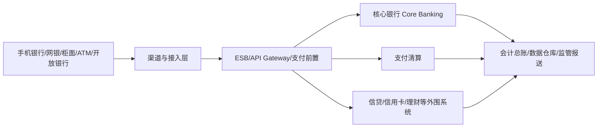

# 银行核心系统培训笔记

这是一套面向 **银行核心系统开发、架构设计、交易处理与账务核算** 的学习笔记。

原始内容以培训速记为主，本版在保留原有知识点的基础上，补充了银行核心常见的业务边界、交易机制、账务模型、支付清算、信贷、系统架构、设计模式以及高可用与容灾等内容。

> 说明：不同银行、不同核心厂商、不同产品线的实现会有差异。本文档描述的是常见设计思想，不代表某一家银行的生产实现。

## 建议阅读顺序

1. [银行核心发展史](./银行核心发展史.md)
2. [业务](./业务.md)
3. [客户与账户](./客户与账户.md)
4. [交易](./交易.md)
5. [核算](./核算.md)
6. [支付清算](./支付清算.md)
7. [信贷](./信贷.md)
8. [系统架构](./系统架构.md)
9. [设计模式](./设计模式.md)
10. [传统核心 V7 架构笔记](./v7.md)
11. [运维与容灾](./运维与容灾.md)

## 核心系统到底负责什么

可以把银行 IT 简化成下面几层：

核心银行系统通常关注：

- 客户与账户基础信息；
- 存款及账户余额；
- 交易处理与账务登记；
- 利息、费用、限额等规则；
- 日切、批量、计提、结息；
- 对总账和外围系统提供一致、可追溯的账务数据。

## 开发人员最重要的几个原则

- **钱不能错**：账务必须可平衡、可追溯、可重放或可补偿。
- **交易不能重复记账**：任何重试场景都要考虑幂等。
- **未知状态比失败更危险**：超时后不能直接假设失败，需要查证、冲正或补偿。
- **业务日期不等于机器日期**：银行大量批量和会计处理依赖业务日期。
- **余额不是唯一真相**：余额、明细、分户账、总账之间必须能够勾稽。
- **外围可以最终一致，核心账务通常要求强一致边界清晰**。
- **所有关键操作必须可审计**：谁、何时、从哪个渠道、以什么流水、改了什么。

## 常见面试与实战主题

- 核心交易如何做幂等；
- 为什么需要冲正；
- 冲正与抹账有什么区别；
- 热点账户如何保证余额正确；
- 日切过程中为什么还能做联机交易；
- 分户账、明细账、总账如何保持一致；
- 支付状态为什么经常出现“处理中”；
- 分布式事务为什么不能只依赖数据库事务；
- 两地三中心、同城双活、异地灾备分别解决什么问题。
