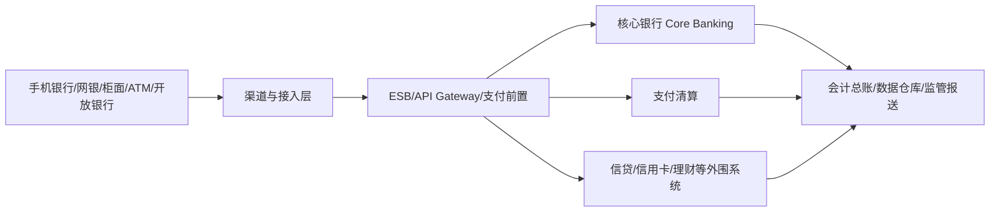

# 银行核心系统培训与研究笔记

这是一套面向 **银行核心系统、交易处理、账务核算、支付清算、存款与信贷业务** 的研究型知识库。

原始内容以培训速记为主，目前逐步整理为：

```text
业务认知
→ 领域对象
→ 业务流程
→ 资金变化
→ 账务模型
→ 会计处理
→ 日终批量
→ 异常与差错
→ 系统架构
```

> 说明：不同银行、不同核心厂商、不同产品线的实现会存在差异。本文档描述常见的银行业务与系统设计思想，不代表某一家银行的具体生产实现。

---

# 1. 建议先看研究路线

第一次系统研究银行核心，建议先阅读：

- [银行核心研究路线](./银行核心研究路线.md)

然后按下面顺序深入：

1. [银行核心发展史](./银行核心发展史.md)
2. [业务](./业务.md)
3. [银行业务模块地图](./银行业务模块地图.md)
4. [客户与账户](./客户与账户.md)
5. [存款业务拆解](./存款业务拆解.md)
6. [产品参数与计价](./产品参数与计价.md)
7. [渠道前置与柜面](./渠道前置与柜面.md)
8. [交易](./交易.md)
9. [核心记账模式](./核心记账模式.md)
10. [核心记账案例集](./核心记账案例集.md)
11. [核算](./核算.md)
12. [会计总账模型拆解](./会计总账模型拆解.md)
13. [支付清算](./支付清算.md)
14. [支付清算模型拆解](./支付清算模型拆解.md)
15. [信贷](./信贷.md)
16. [信贷模型拆解](./信贷模型拆解.md)
17. [信贷业务场景拆解](./信贷业务场景拆解.md)
18. [限额风控与差错处理](./限额风控与差错处理.md)
19. [批量日终与对账](./批量日终与对账.md)
20. [系统架构](./系统架构.md)
21. [设计模式](./设计模式.md)
22. [传统核心 V7 架构笔记](./v7.md)
23. [运维与容灾](./运维与容灾.md)

---

# 2. 银行核心业务域地图

```text
银行核心及周边业务平台
├─ 客户域
│  ├─ 客户主数据
│  ├─ 客户关系
│  ├─ KYC
│  └─ 客户统一视图
│
├─ 产品与参数域
│  ├─ 产品工厂
│  ├─ 产品版本
│  ├─ 利率
│  ├─ 手续费
│  ├─ 限额
│  └─ 会计映射
│
├─ 账户与存款域
│  ├─ 开户
│  ├─ 活期
│  ├─ 定期
│  ├─ 冻结/解冻
│  ├─ 止付
│  ├─ 计息/结息
│  └─ 销户
│
├─ 渠道与接入域
│  ├─ 柜面
│  ├─ 手机银行
│  ├─ 网银
│  ├─ ATM
│  ├─ 开放银行 API
│  └─ ESB / Gateway
│
├─ 交易与记账域
│  ├─ 流水
│  ├─ 幂等
│  ├─ 状态机
│  ├─ 余额
│  ├─ 明细账
│  ├─ 会计分录
│  ├─ 冲正/抹账
│  └─ 总分账
│
├─ 支付与清算域
│  ├─ 支付订单
│  ├─ 支付指令
│  ├─ 行内支付
│  ├─ 跨行来账/往账
│  ├─ 在途资金
│  ├─ 清分
│  ├─ 清算/结算
│  ├─ 退款/退汇
│  └─ 对账
│
├─ 信贷域
│  ├─ 申请
│  ├─ 授信
│  ├─ 额度
│  ├─ 合同
│  ├─ 借据
│  ├─ 放款
│  ├─ 还款计划
│  ├─ 计息
│  ├─ 还款
│  ├─ 逾期
│  ├─ 催收
│  ├─ 核销
│  └─ 结清
│
├─ 会计总账域
│  ├─ 科目
│  ├─ 内部户
│  ├─ 会计事件
│  ├─ 凭证
│  ├─ 分户账
│  ├─ 总账
│  ├─ 损益
│  └─ 总分核对
│
├─ 限额风控与差错域
│  ├─ 业务限额
│  ├─ 限额预占
│  ├─ 实时风控
│  ├─ 差错发现
│  ├─ 单边账
│  ├─ 挂账
│  ├─ 补账
│  └─ 调账
│
├─ 日终与批量域
│  ├─ 日切
│  ├─ 计提
│  ├─ 结息
│  ├─ 到期
│  ├─ 逾期迁移
│  ├─ 总账汇总
│  └─ 对账
│
└─ 技术支撑域
   ├─ 缓存
   ├─ MQ
   ├─ 分布式事务
   ├─ 高可用
   ├─ 容灾
   └─ 可观测性
```

更完整拆分见 [银行业务模块地图](./银行业务模块地图.md)。

---

# 3. 核心系统到底负责什么

可以把银行 IT 简化成下面几层：



核心银行系统通常关注：

- 客户与账户基础信息；
- 存款及账户余额；
- 交易处理与账务登记；
- 利息、费用、限额等规则；
- 日切、批量、计提、结息；
- 对总账和外围系统提供一致、可追溯的账务数据。

---

# 4. 核心记账主线

银行核心最值得先理解的一条主线：

```text
业务请求
↓
交易流水
↓
业务规则校验
↓
账务事件
↓
会计规则
↓
借贷分录
↓
账户余额
↓
账户明细
↓
分户账
↓
总账
↓
日终对账
```

建议先读 [核心记账模式](./核心记账模式.md)，再结合 [核心记账案例集](./核心记账案例集.md) 看具体业务。

---

# 5. 信贷主线

```text
客户
↓
授信申请
↓
额度
↓
合同
↓
借据
↓
放款
↓
贷款账户
↓
还款计划
↓
计息/还款
↓
逾期/催收
↓
结清/核销
```

真正的信贷系统不是一张 loan 表，而是一组相互约束的业务对象。

建议先读 [信贷模型拆解](./信贷模型拆解.md)，再结合 [信贷业务场景拆解](./信贷业务场景拆解.md) 理解消费贷、按揭、对公流贷、受托支付、提前还款、逾期和核销。

---

# 6. 研究银行核心时最重要的原则

- **钱不能错**：账务必须平衡、可追溯、可核对。
- **同一业务不能重复改变资金**：任何重试都要理解幂等语义。
- **未知状态比明确失败更危险**：超时后必须查证，而不是直接认为失败。
- **业务日期不等于机器日期**：日切和批量依赖银行业务日期。
- **余额不是唯一真相**：余额、明细、分户账、总账之间必须能够互相解释。
- **业务状态和资金状态必须区分**：订单完成不一定意味着最终清算完成。
- **正式记账后通常通过反向分录纠正，而不是删除历史。**
- **异常资金必须进入可控范围**：在途、挂账、待清算都不是“丢失”。
- **所有关键操作必须能够审计和追溯。**

---

# 7. 银行核心必须记住的几个不变量

```text
借方合计 = 贷方合计
```

```text
期初余额 + 有效发生额 = 当前余额
```

```text
同一个业务请求只能产生一次有效资金变化
```

```text
总账科目余额 = 对应分户余额汇总
```

```text
任何余额变化都必须能追溯到交易、批次或调账凭证
```

```text
冲正必须关联原交易
```

```text
信贷业务余额、贷款账户、还款计划和会计余额必须能够勾稽
```

---

# 8. 推荐研究方式

不要只按文件背概念，建议每学一个业务，都从下面几个角度拆：

```text
业务对象是什么？
↓
业务状态怎么变化？
↓
钱从哪里到哪里？
↓
哪些余额发生变化？
↓
生成什么会计分录？
↓
异常时怎么恢复？
↓
日终怎么处理？
↓
最终怎么对账？
```

优先把下面七个完整场景研究透：

1. 行内转账；
2. 跨行转账；
3. 活期计息与结息；
4. 定期存款到期；
5. 贷款放款；
6. 贷款正常还款与逾期；
7. 核心交易超时、冲正和对账。

这七个场景能够串起银行核心的大部分重要概念。
