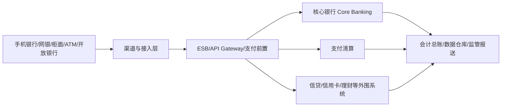

# 银行核心系统培训与研发笔记

这是一套面向 **银行核心系统开发、架构设计、交易处理、账务核算、支付清算与信贷研发** 的知识库。

原始内容以培训速记为主，目前逐步整理为“业务认知 + 领域模型 + 账务模型 + 系统架构 + Java 工程实践”的结构。

> 说明：不同银行、不同核心厂商、不同产品线的实现会存在差异。本文档描述常见的银行业务与系统设计思想，不代表某一家银行的具体生产实现。

---

# 1. 总体阅读路径

如果第一次系统学习银行核心，建议按下面顺序：

1. [银行核心发展史](./银行核心发展史.md)
2. [业务](./业务.md)
3. [银行业务模块地图](./银行业务模块地图.md)
4. [客户与账户](./客户与账户.md)
5. [存款业务拆解](./存款业务拆解.md)
6. [交易](./交易.md)
7. [核心记账模式](./核心记账模式.md)
8. [核算](./核算.md)
9. [支付清算](./支付清算.md)
10. [信贷](./信贷.md)
11. [信贷模型拆解](./信贷模型拆解.md)
12. [产品参数与计价](./产品参数与计价.md)
13. [批量日终与对账](./批量日终与对账.md)
14. [系统架构](./系统架构.md)
15. [设计模式](./设计模式.md)
16. [传统核心 V7 架构笔记](./v7.md)
17. [运维与容灾](./运维与容灾.md)

---

# 2. 银行核心业务域地图

```text
银行核心及周边业务平台
├─ 客户域
│  ├─ 客户主数据
│  ├─ 客户关系
│  ├─ KYC
│  └─ 客户统一视图
│
├─ 产品与参数域
│  ├─ 产品工厂
│  ├─ 产品版本
│  ├─ 利率
│  ├─ 手续费
│  ├─ 限额
│  └─ 会计映射
│
├─ 账户与存款域
│  ├─ 开户
│  ├─ 活期
│  ├─ 定期
│  ├─ 冻结/解冻
│  ├─ 止付
│  ├─ 计息/结息
│  └─ 销户
│
├─ 交易与记账域
│  ├─ 流水
│  ├─ 幂等
│  ├─ 状态机
│  ├─ 余额
│  ├─ 明细账
│  ├─ 会计分录
│  ├─ 冲正/抹账
│  └─ 总分账
│
├─ 支付与清算域
│  ├─ 行内支付
│  ├─ 跨行支付
│  ├─ 来账/往账
│  ├─ 清分
│  ├─ 清算
│  ├─ 退汇
│  └─ 对账
│
├─ 信贷域
│  ├─ 申请
│  ├─ 授信
│  ├─ 额度
│  ├─ 合同
│  ├─ 借据
│  ├─ 放款
│  ├─ 还款计划
│  ├─ 计息
│  ├─ 还款
│  ├─ 逾期
│  ├─ 催收
│  ├─ 核销
│  └─ 结清
│
├─ 会计总账域
│  ├─ 科目
│  ├─ 分户账
│  ├─ 总账
│  ├─ 损益
│  └─ 总分核对
│
├─ 日终与批量域
│  ├─ 日切
│  ├─ 计提
│  ├─ 结息
│  ├─ 到期
│  ├─ 逾期迁移
│  ├─ 总账汇总
│  └─ 对账
│
└─ 技术支撑域
   ├─ 渠道/ESB/API
   ├─ 缓存
   ├─ MQ
   ├─ 分布式事务
   ├─ 高可用
   ├─ 容灾
   └─ 可观测性
```

更完整拆分见 [银行业务模块地图](./银行业务模块地图.md)。

---

# 3. 核心系统到底负责什么

可以把银行 IT 简化成下面几层：



核心银行系统通常关注：

- 客户与账户基础信息；
- 存款及账户余额；
- 交易处理与账务登记；
- 利息、费用、限额等规则；
- 日切、批量、计提、结息；
- 对总账和外围系统提供一致、可追溯的账务数据。

---

# 4. 核心记账主线

银行核心研发最值得先理解的一条主线：

```text
业务请求
↓
交易流水
↓
业务规则校验
↓
账务事件
↓
会计规则
↓
借贷分录
↓
账户余额
↓
账户明细
↓
分户账
↓
总账
↓
日终对账
```

详细见 [核心记账模式](./核心记账模式.md)。

---

# 5. 信贷主线

```text
客户
↓
授信申请
↓
额度
↓
合同
↓
借据
↓
放款
↓
贷款账户
↓
还款计划
↓
计息/还款
↓
逾期/催收
↓
结清/核销
```

真正的信贷系统不是一张 loan 表，而是一组相互约束的领域对象。

详细见 [信贷模型拆解](./信贷模型拆解.md)。

---

# 6. 开发人员最重要的原则

- **钱不能错**：账务必须可平衡、可追溯、可重放或可补偿。
- **交易不能重复记账**：任何重试场景都要考虑幂等。
- **未知状态比失败更危险**：超时后不能直接假设失败，需要查证、冲正或补偿。
- **业务日期不等于机器日期**：银行大量批量和会计处理依赖业务日期。
- **余额不是唯一真相**：余额、明细、分户账、总账之间必须能够勾稽。
- **业务状态和资金状态要分开**：订单成功不等于清算已经最终完成。
- **外围可以最终一致，但资金核心必须明确强一致边界**。
- **已经正式记账的数据通常通过反向分录纠正，不应直接删除**。
- **所有关键操作必须可审计**：谁、何时、从哪个渠道、以什么流水、修改了什么。

---

# 7. 银行核心必须记住的几个不变量

```text
借方合计 = 贷方合计
```

```text
期初余额 + 有效发生额 = 当前余额
```

```text
同一个业务请求只能产生一次有效资金变化
```

```text
总账科目余额 = 对应分户余额汇总
```

```text
任何余额变化都必须能追溯到交易、批次或调账凭证
```

```text
冲正必须关联原交易
```

```text
信贷业务余额、贷款账户和会计余额必须能勾稽
```

---

# 8. 推荐后续工程化方向

知识文档之后，可以继续建设一个 Java 银行核心练习项目：

```text
bank-core-demo
├─ customer-service
├─ product-service
├─ account-service
├─ transaction-service
├─ posting-engine
├─ payment-service
├─ credit-limit-service
├─ loan-service
├─ interest-engine
├─ ledger-service
├─ batch-service
└─ reconciliation-service
```

建议首先实现：

1. 行内转账；
2. 幂等；
3. 账户并发控制；
4. Posting Engine；
5. 冲正；
6. Outbox；
7. 日终对账；
8. 授信额度；
9. 贷款放款；
10. 还款计划和还款分配。

这套项目如果实现完整，会比单独写 CRUD 更能体现银行核心 Java 开发能力。
