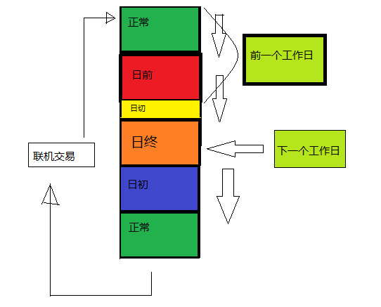
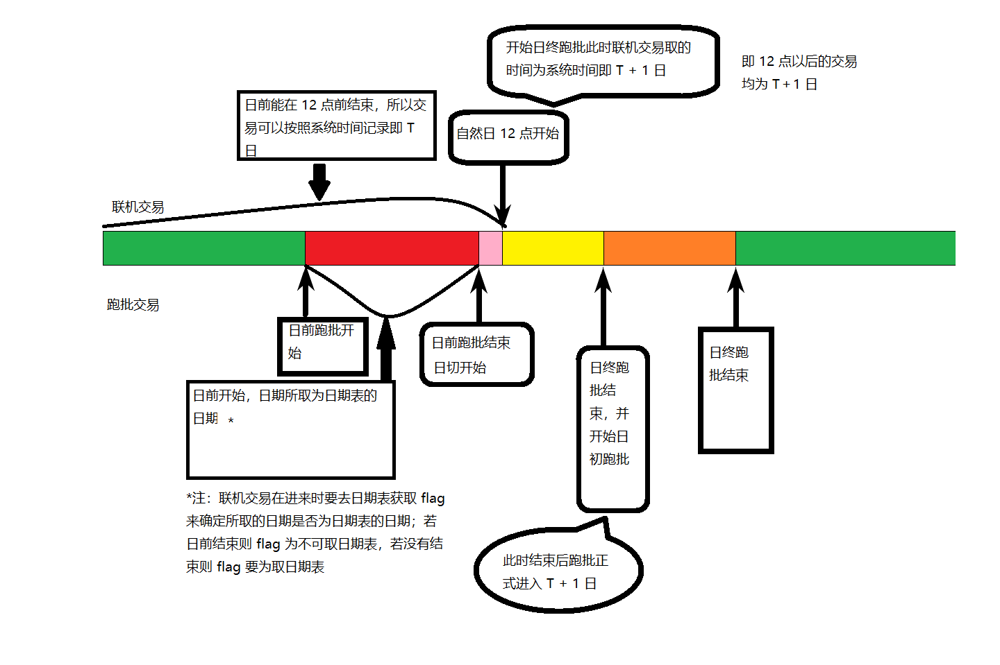
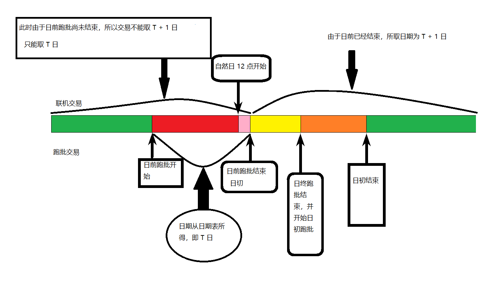

## 什么是交易

银行里的“交易”不只是一次接口调用，而是一组需要被唯一标识、校验、执行、记账、返回并最终可追溯的业务过程。

典型链路：

```text
渠道 -> API Gateway / ESB / 前置 -> 核心 / 支付系统 -> 会计 / 数据平台
```

常见流水：

- 全局流水号：跨系统定位一笔请求；
- 渠道流水号：渠道侧生成；
- 核心流水号：核心受理后生成；
- 支付流水号：支付系统或清算系统生成；
- 原交易流水号：冲正、撤销、退汇等反向交易必须关联。

## ESB / 前置系统

常见职责：

- 路由转发；
- 协议转换；
- 报文解析与组装；
- 统一认证；
- 服务编排；
- 限流与熔断；
- 统一流水；
- 超时控制。

不要把核心账务逻辑放在 ESB 中。ESB 更适合做接入、编排和适配。

## 一笔核心交易的生命周期

典型流程：

1. 接收请求；
2. 生成或校验幂等键；
3. 校验客户、账户、产品、币种、限额；
4. 检查账户状态、余额、冻结、透支额度；
5. 锁定或串行化关键资源；
6. 执行业务逻辑；
7. 生成账务分录；
8. 更新余额和交易明细；
9. 落交易流水；
10. 提交本地事务；
11. 向外围系统发送事件或结果；
12. 返回渠道。

原则：**一笔金融交易必须能够根据流水恢复出“发生了什么”。**

## 幂等

银行交易最怕“重复记账”。

常见幂等键：

```text
渠道号 + 渠道流水号 + 交易日期
```

或：

```text
业务场景 + 客户请求号
```

幂等处理常见结果：

- 首次请求：正常执行；
- 重复请求且原交易成功：返回原结果；
- 原交易失败：按规则返回失败；
- 原交易处理中：返回处理中或进入状态查询；
- 原交易状态未知：禁止直接再次扣账。

## 交易状态机

推荐显式定义交易状态，而不是只用成功/失败两个值。

```text
INIT
  -> PROCESSING
      -> SUCCESS
      -> FAILED
      -> UNKNOWN
            -> SUCCESS
            -> FAILED
            -> REVERSED
```

`UNKNOWN` 很重要，它代表系统无法确认远端是否成功。

## 超时

超时只是“调用方没有按时拿到响应”，并不代表业务失败。

例如：

1. 核心完成扣款；
2. 核心事务提交；
3. 网络返回超时；
4. 渠道看到 timeout；
5. 渠道再次提交同一交易。

如果没有幂等，就可能重复扣款。

正确处理通常包括：

- 幂等；
- 状态查询；
- 冲正；
- 补偿；
- 对账。

## 账户余额并发

热点账户是银行核心的经典难题。

错误思路：

```text
先 select balance
应用层 balance - amount
再 update balance
```

高并发下容易发生丢失更新。

常见方案：

- 数据库行锁；
- 原子 update；
- 乐观锁版本号；
- 按账户分片串行队列；
- 热点账户特殊处理；
- 余额与流水双重校验。

示例：

```sql
update account
set balance = balance - :amount
where account_no = :accountNo
  and balance >= :amount;
```

根据影响行数判断是否成功，避免先查再改的竞态窗口。

## 冲正

冲正用于处理交易结果不确定或需要对原交易做技术性反向处理的场景。

典型场景：

- 渠道超时；
- 支付前置超时；
- 下游返回不确定；
- 原交易部分完成。

基本原则：

- 冲正必须关联原交易；
- 同一原交易只能按规则冲正一次；
- 原交易未成功时冲正不能重复扣/加资金；
- 冲正本身也是一笔交易，有独立流水；
- 冲正要可重试、可审计。

## 撤销、冲正、抹账的区别

| 类型 | 常见触发 | 本质 | 是否关联原交易 |
|---|---|---|---|
| 撤销 | 客户或业务主动取消 | 正常业务反向 | 是 |
| 冲正 | 超时、技术故障、状态不确定 | 技术补偿 | 是 |
| 抹账 | 柜员误操作等业务纠错 | 账务纠错 | 是 |

不同银行定义和权限可能不同，但不要把三者混为一谈。

## 日切

日期切换，是银行系统把当前业务日切换到下一业务日，并完成日终/日初批量处理的机制。

典型阶段：

```text
日前 -> 日切 -> 日终 -> 日初
```

现代核心通常要求日切过程中联机交易仍可继续处理。



日期来源常见有：

1. 业务日期表；
2. 系统时间。

在不同批量阶段，根据标志位决定联机交易使用哪个日期。

例如：

| flag | 日期表 | 系统日期 |
| ---| --- | --- |
| 0 | x | ✔ |
| 1 | ✔ | x |





这里最重要的不是具体 flag 取值，而是理解：

- 机器日期不等于业务日期；
- 日切期间必须确保交易按正确业务日入账；
- 批量与联机不能互相破坏一致性。

## 双余额机制

一种常见历史实现，是同时维护当前余额和上一业务日余额，以支持跨日处理。

```text
| 当前余额 | 上次更新日期 | 上日余额 | 发生交易日期 |
| balance | last_date | last_balance | date |
```

处理示意：

```text
交易日期 > 上次交易日期：
    1. 当前余额 -> 上次余额
    2. 当前余额 +/- 交易金额 -> 当前余额
    3. 交易日期 -> 上次交易日期

交易日期 = 上次交易日期：
    1. 当前余额 +/- 交易金额 -> 当前余额

交易日期 < 上次交易日期：
    1. 当前余额 +/- 交易金额 -> 当前余额
    2. 上次余额 +/- 交易金额 -> 上次余额
```

这类设计本质上是在解决跨日联机和账务连续性问题。

## 对账

对账是兜底机制，不是失败后的“人工看一下”。

常见对账：

- 渠道与核心；
- 核心与支付；
- 支付与清算机构；
- 分户账与总账；
- 业务系统与会计系统。

典型对账结果：

- 双方都有且金额一致；
- 我方有、对方无；
- 我方无、对方有；
- 双方都有但金额或状态不一致。

对于差异，应有自动补单、冲正、挂账或人工处理流程。

## 交易开发检查清单

新增一笔金融交易时至少要回答：

- 幂等键是什么？
- 原交易流水如何保存？
- 超时后怎么办？
- 是否允许重试？
- 余额并发怎么控制？
- 哪些数据必须同一事务提交？
- 下游失败是回滚还是补偿？
- 是否需要冲正？
- 是否需要对账？
- 日切期间如何处理？
- 是否需要审计日志？
