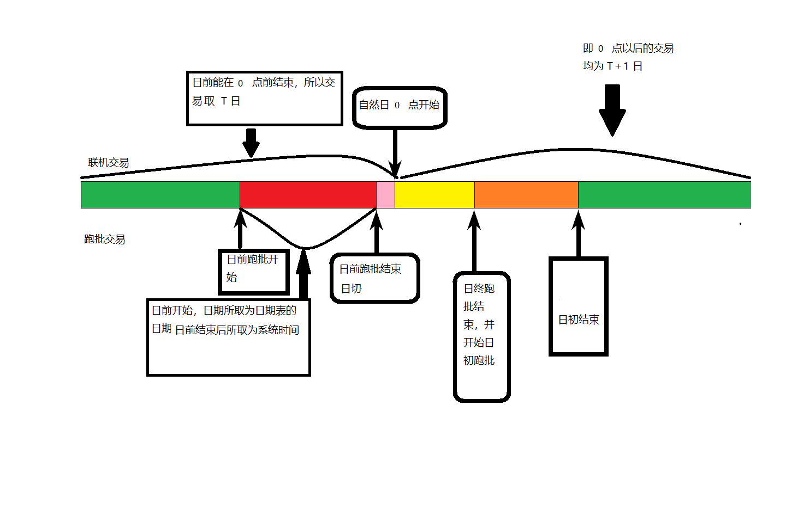

## 什么是交易

渠道 -> ESB -> 核心 \ 支付系统 -> 仓库

全局流水号
交易流水号

- ESB

  转发
  组合

- 核心

  核心流水号
  序号
  存于批量中

- 缓存

## 日切

日期切换，更换系统记账的时间；对当天的系统业务进行集中处理，处理完毕后，系统从当前工作日切换到下一工作日，日切过程中交易可以照常提交并正确处理返回。

- 准点日切

日前 --->日切 ---> 日终 ---> 日初


日期采取两种方式进行：
 1. 到点采取读取日期表的方式
 2. 取数据库机器上的系统日期

分以下两种情况分别采取不同的上述两种方式:
1. 在 12 点前日前跑批结束
2. 日前在 12 点前日前跑批没有结束



红色为日前处理，日前处理在 12 点前跑完了，所以粉色为空挡期，这段时间虽然完成了日切，但是还没有到 12 点，所以联机交易的日期为 T 日，但日期不从日期表所取，由系统时间来决定，一旦到了 12 点则日期为 T + 1 日。

在日前启动时，首先要将日期表中的 flag 设为 1 ，而在日切时将 flag 设为 0；从而使联机交易进来时知道自己所选取的日期来源。

| flag | 日期表 | 系统日期 |
| ---| --- | --- |
| 0 | x | ✔ |
| 1 | ✔ | x |


上述图片中 红色 + 粉红色为日前的时间，粉红色为超出日前超过  12  点的时间，此时进来的联机交易从日期表中获取均为 T 日，直到日切结束使用系统时间来记录日期为 T + 1 日。

- 双余额机制

将余额分为当前余额和上次更新余额

```
分户处理：
按照交易的日期分为次日，前日处理
表字段增加以下

| 当前余额 | 上次更新日期 | 上日余额 | 发生交易时 |
| balance | last_date | last_balance | date |

交易日期 > 上次交易日期 ：
    1.当前余额 → 上次余额
    2.当前余额 +/- 交易金额 → 当前余额
    3.交易日期 → 上次交易日期
交易日期 = 上次交易日期 ：
    1.当前余额 +/- 交易金额 → 当前余额
交易日期 < 上次交易日期 ：
    1.当前余额 +/- 交易金额 → 当前余额
    2.上次余额 +/- 交易金额 → 上次余额

```
